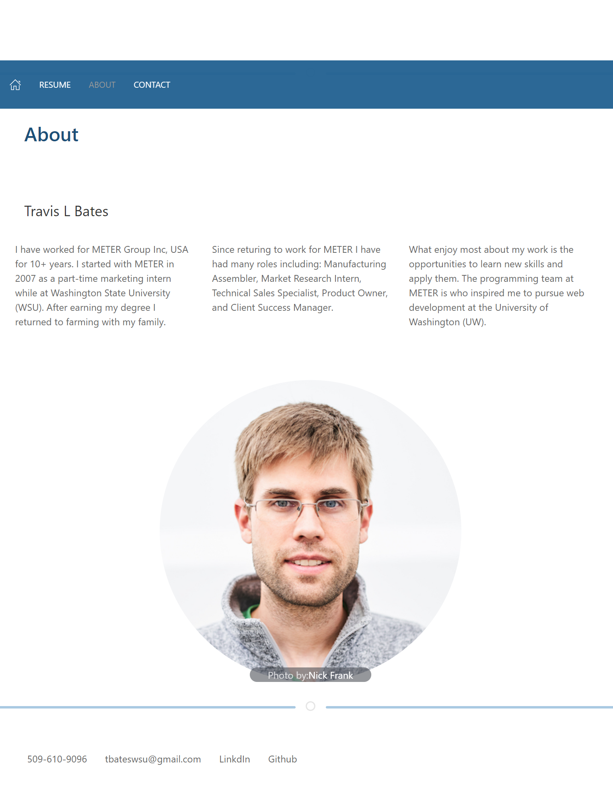

# <profile>

# Description

This web site is my portfolio page built using REACT. You will find examples of my work with links to the deployed applications and Github repositories.

## About

This website uses UK kit to create the layout and interactions. The web page is responsive to multiple screen sizes. Use the projects drop-down to quickly jump to a project. Each project shows the technologies used when hovering over the Stack. Expand the Links section on a project to show the Repository and Application links. The site also includes a form that uses REACT useState to validate the email and phone fields, as well as notify the user when a field is required.

## Installation

To run this application download the code from the repository and type `npm i` to install the dependencies.

Make sure the following are installed:

Node: [Node.js](https://nodejs.org/en/download/).

Express: [Express.js](https://www.npmjs.com/package/express).

React: [React](https://www.npmjs.com/package/react).

To run the app in development type `npm start` from the project directory which will open [http://localhost:3000](http://localhost:3000) so you can view it in your browser.

To create a distributed build type `npm run build`. This will build the app for production to the `build folder`. This bundles in React for production mode and optimizes the app for the best perfomance.

To deploy a build version to GitHub follow these steps here [Create React App](https://create-react-app.dev/docs/deployment/#github-pages)

### Desktop

## View the Project

Navigate to [profile](https://levisgaragegroupinc.github.io/Profile_v2/) to view the deployed page.

## Credits

UIKit, React, Express, Node.js,
